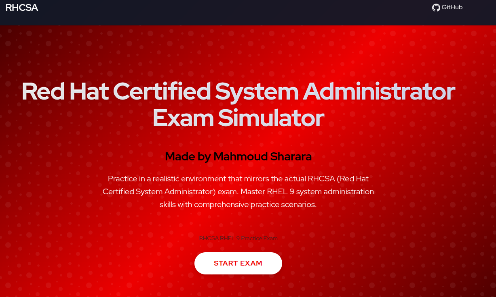

# Red Hat Exam Simulator 🚀



A powerful Red Hat certification practice environment that provides a realistic exam-like experience for Red Hat exam preparation.

**Red Hat Certification Exam Simulator** - Practice in a realistic environment that mirrors the actual RHCSA, RHCE, and other Red Hat certification exams. Enhanced with Red Hat exam questions and dumps by sharara for comprehensive preparation.

## Major Features

- **Realistic exam environment** with web-based interface and remote desktop support
- Comprehensive practice labs for **RHCSA, RHCE**, and other Red Hat certifications
- **Smart evaluation system** with real-time solution verification
- **Docker-based deployment** for easy setup and consistent environment
- **Timed exam mode** with real exam-like conditions and countdown timer 


## Installation

#### Linux & macOS
```bash
curl -fsSL https://raw.githubusercontent.com/nishanb/ck-x/master/scripts/install.sh | bash
```

#### Windows ( make sure WSL2 is enabled in the docker desktop )
```powershell
irm https://raw.githubusercontent.com/nishanb/ck-x/master/scripts/install.ps1 | iex
```

### Manual Installation
For detailed installation instructions, please refer to our [Deployment Guide](scripts/COMPOSE-DEPLOY.md).

## How to Use - RHCSA Exam Environment

### Starting the Exam

1. **Access the Web Interface**: Navigate to `http://localhost:30080` (or your configured port)
2. **Select RHCSA Lab**: Choose the RHCSA exam from the available labs
3. **Click "Start Exam"**: The system will prepare your exam environment
4. **Wait for Preparation**: The environment setup may take 1-2 minutes. You'll see "Preparation in progress" status.

### Pre-Configured Components

The RHCSA exam environment comes with several pre-configured components to match real exam scenarios:

#### Network Configuration
- **Network Interface "wire"**: A permanent dummy network interface pre-configured for networking questions
- **NetworkManager**: Fully configured with D-Bus support for `nmcli` commands
- **Hostname Resolution**: 
  - `node1` → `127.0.0.1`
  - `classroom.example.com` → `192.168.71.254`

#### User Configuration
- **Default User**: `root` (all commands run as root)
- **User "alth"**: Pre-created for container-related questions (Q12, Q13)
- **SSH Access**: Passwordless SSH configured for `node1`

#### Directories
The following directories are pre-created for exam questions:
- `/root/locatedfiles` - For file location exercises (Q8)
- `/opt/files` and `/opt/processed` - For container volume mounts (Q13)
- `/mnt/database` - For LVM mount point (Q21)

#### Tools and Services
- **LVM2 Tools**: Installed and ready for logical volume management questions
- **NetworkManager CLI**: `nmcli` with bash completion enabled
- **D-Bus**: System daemon running for service management

### Common Commands

#### Network Management
```bash
# View network connections
nmcli con show

# View the "wire" interface
nmcli con show wire

# Check network interface status
ip link show wire

# View general network status
nmcli general status
```

#### Accessing Remote Systems
```bash
# SSH to node1 (passwordless)
ssh node1

# SSH to node1 with password (if needed)
ssh node1
# Password: 123
```

#### LVM Operations
```bash
# List physical volumes
pvs

# List volume groups
vgs

# List logical volumes
lvs

# Display detailed LVM information
pvdisplay
vgdisplay
lvdisplay
```

### Troubleshooting

#### NetworkManager Connection Issues
If `nmcli` shows "Connection refused":
```bash
# Check if D-Bus is running
ps aux | grep dbus-daemon

# Check D-Bus socket
ls -la /var/run/dbus/system_bus_socket

# The environment variable should be set automatically
echo $DBUS_SYSTEM_BUS_ADDRESS
```

#### Container Not Starting
If the remote desktop container exits:
```bash
# Check container logs
docker compose logs remote-desktop

# Restart the container
docker compose restart remote-desktop

# Rebuild if needed
docker compose build remote-desktop
docker compose up -d remote-desktop
```

#### Exam Preparation Stuck
If exam preparation is stuck at "Preparation in progress":
1. Wait up to 2 minutes (the timeout was increased for API server readiness)
2. Check facilitator logs: `docker compose logs facilitator`
3. Check jumphost logs: `docker compose logs jumphost`
4. Try terminating and starting a new exam session

### Exam Question Types

The RHCSA exam environment includes questions covering:

1. **Networking** (Q1): Configure TCP/IP, hostname, and network interfaces using `nmcli`
2. **Package Management** (Q2, Q18): Configure YUM repositories
3. **SELinux & Firewall** (Q3): Debug and configure SELinux policies and firewall rules
4. **User Management** (Q4, Q7, Q16): Create users, groups, and manage permissions
5. **Cron Jobs** (Q5): Configure scheduled tasks
6. **File Permissions** (Q6, Q16): Set up collaborative directories with proper permissions
7. **File Operations** (Q8, Q9): Find and copy files, search text
8. **AutoFS** (Q10): Configure automatic NFS mounts
9. **Archives** (Q11): Create tar archives with compression
10. **Containers** (Q12, Q13): Build and manage Podman containers
11. **Scripting** (Q14): Create and deploy shell scripts
12. **Time Synchronization** (Q15): Configure NTP with chrony
13. **LVM** (Q19, Q21): Resize and create logical volumes
14. **Swap** (Q20): Create and configure swap partitions
15. **Tuned Profiles** (Q22): Configure system performance profiles

### Tips for Success

1. **Use Tab Completion**: `nmcli` commands support bash completion - press Tab for suggestions
2. **Check Pre-configured Items**: Many components are already set up - verify before creating new ones
3. **Read Questions Carefully**: Pay attention to specific requirements (names, sizes, paths)
4. **Verify Your Work**: Use the verification scripts or manual checks before submitting
5. **Practice Common Commands**: Familiarize yourself with `nmcli`, `lvm`, `systemctl` alternatives

### Getting Help

- Check the [answers file](facilitator/assets/exams/rhcsa/001/answers.md) for detailed solutions
- Review container logs if something isn't working
- Ensure all services are running: `docker compose ps`

## Community & Support

- Join our [Discord Community](https://discord.gg/6FPQMXNgG9) for discussions and support
- Feature requests and pull requests are welcome

## Adding New Labs

Check our [Lab Creation Guide](docs/how-to-add-new-labs.md) for instructions on adding new labs.

## Contributing

We welcome contributions! Whether you want to:
- Add new practice labs
- Improve existing features
- Fix bugs
- Enhance documentation

## Buy Me a Coffee ☕

If you find Red Hat Exam Simulator helpful, consider [buying me a coffee](https://buymeacoffee.com/nishan.b) to support the project.

## Disclaimer

This Red Hat Exam Simulator is an independent tool, not affiliated with Red Hat, Inc. or PSI. We do not guarantee exam success. Please read our [Privacy Policy](docs/PRIVACY_POLICY.md) and [Terms of Service](docs/TERMS_OF_SERVICE.md) for more details about data collection, usage, and limitations.

## Acknowledgments

- [DIND](https://www.docker.com/)
- [Node](https://nodejs.org/en)
- [Nginx](https://nginx.org/)
- [ConSol-Vnc](https://github.com/ConSol/docker-headless-vnc-container/)
- [Red Hat Enterprise Linux](https://www.redhat.com/en/technologies/linux-platforms/enterprise-linux)

## License

This project is licensed under the MIT License - see the LICENSE file for details. 
